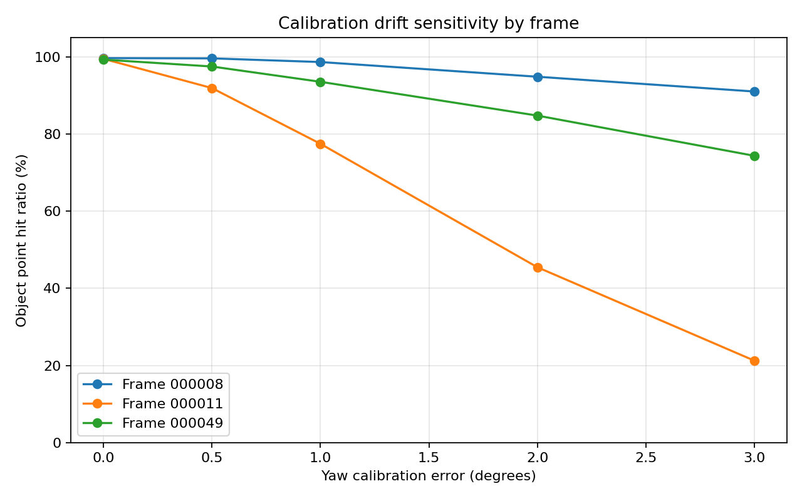
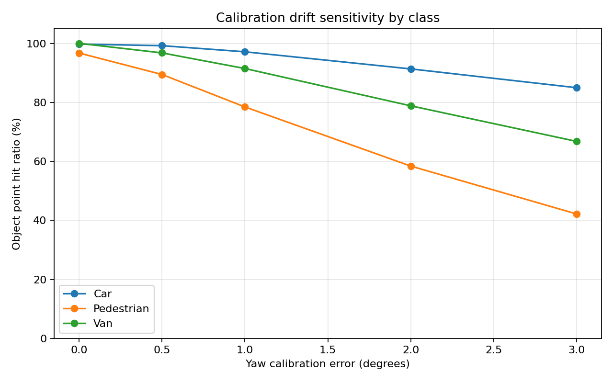
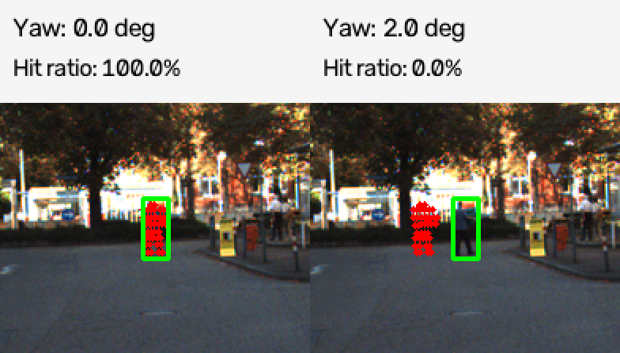

# Báo cáo Day 6: Đánh giá ảnh hưởng của sai lệch yaw đến LiDAR–Camera Calibration

- **Họ tên:** Bùi Đức Thành
- **MSSV:** 2A202602364
- **Lớp:** AI20K-T4
- **Link repo:** https://github.com/n4hhh/K4-Track4-Day06-3D-From-Point-Clouds
- **Topic:** A — LiDAR-camera Calibration QA
- **Dataset:** data/kitti_mini (benchmark), data/synthetic và data/nuscenes_mini_subset (kiểm tra projection)
- **Các frame đã dùng:** 000008, 000011, 000049 (benchmark); 000000, 000004, 000019, scene-0103_010 (demo)

## 1. Claim

Sai lệch yaw calibration 1° làm tỉ lệ điểm LiDAR thuộc vật thể rơi đúng trong 2D bounding box giảm ít nhất 15 điểm phần trăm ở frame 000011, trong khi frame 000008 giảm dưới 5 điểm phần trăm.

Thí nghiệm được thực hiện với yaw 0°, 0.5°, 1°, 2° và 3°, giữ nguyên dữ liệu, frame và các thông số khác. Metric chính là hit ratio, tính bằng số điểm LiDAR thuộc 3D box của vật thể, còn chiếu được vào ảnh và nằm trong 2D box, chia cho tổng số điểm thuộc vật thể còn chiếu được vào ảnh.

## 2. Evidence

| Yaw (độ) | Frame 000008 | Frame 000011 | Frame 000049 |
|---|---:|---:|---:|
| 0.0 | 99.63% | 99.45% | 99.25% |
| 0.5 | 99.57% | 91.88% | 97.46% |
| 1.0 | 98.62% | 77.44% | 93.50% |
| 2.0 | 94.81% | 45.44% | 84.74% |
| 3.0 | 90.98% | 21.23% | 74.32% |

Khi yaw lệch 1°, hit ratio ở frame 000011 giảm 22.01 điểm phần trăm, trong khi frame 000008 chỉ giảm 1.01 điểm phần trăm. Ở yaw 2°, frame 000011 giảm từ 99.45% xuống 45.44%. Như vậy, số liệu ủng hộ claim ban đầu. Mức ảnh hưởng khác nhau đáng kể giữa các frame, cho thấy điều kiện cảnh và đặc điểm vật thể đóng vai trò quan trọng.

Thí nghiệm xuất ra 15 dòng kết quả tổng hợp, 30 dòng thống kê theo class và 150 dòng thống kê theo object. Chạy lại toàn bộ benchmark cho ba file CSV giống hệt lần đầu, xác nhận tính tái lập của kết quả.






Các bảng dữ liệu nằm tại `results/yaw_perturb_sweep.csv`, `results/yaw_by_class.csv` và `results/yaw_objects.csv`.

## 3. Failure case



- **Trường hợp:** KITTI frame 000011, pedestrian có object ID 3, cách cảm biến khoảng 34.15 m.
- **Quan sát:** Với calibration gốc, hit ratio của object là 100%. Khi yaw bị làm lệch 2°, hit ratio giảm xuống 0%, tương đương giảm 100 điểm phần trăm.
- **Nguyên nhân:** Sai lệch extrinsic rotation làm vị trí chiếu của điểm LiDAR thay đổi. Với vật thể nhỏ ở xa, dịch chuyển theo pixel có thể đủ lớn để toàn bộ điểm được xét nằm ngoài 2D bounding box.
- **Lớp debug:** Geometry — sai biến đổi hình học LiDAR sang camera.
- **Cách phát hiện khi chạy thật:** Theo dõi alignment score giữa điểm LiDAR và vùng vật thể trên camera. Ngưỡng hit ratio dưới 80% có thể dùng làm điểm xuất phát để đánh giá, nhưng cần kiểm chứng trên nhiều cảnh và điều kiện cảm biến trước khi sử dụng thực tế.

Failure case cho thấy một calibration sai tương đối nhỏ có thể gây lỗi nghiêm trọng với vật thể hẹp. Tuy nhiên, kết quả 100% xuống 0% chỉ áp dụng cho object được chọn, không đại diện cho mọi người đi bộ.

## 4. Khuyến nghị nếu triển khai thật

Use-case đề xuất là hệ thống ADAS hoặc xe robot giao hàng sử dụng đồng thời LiDAR và camera để nhận biết chướng ngại vật, đặc biệt là người đi bộ.

Hệ thống nên theo dõi hit ratio hoặc alignment score trên các vật thể được phát hiện đủ tin cậy. Có thể thử ngưỡng cảnh báo 80% trên cửa sổ nhiều frame liên tiếp để giảm cảnh báo giả; ngưỡng này cần hiệu chỉnh bằng tập validation độc lập.

Đánh đổi khi triển khai là chi phí tính toán cho projection, matching và kiểm tra chất lượng dữ liệu. Chạy kiểm tra liên tục có thể phát hiện drift sớm hơn nhưng tốn tài nguyên hơn so với kiểm tra định kỳ. Các chỉ số nên ghi log gồm hit ratio theo class, khoảng cách vật thể, số điểm hợp lệ, độ lệch thời gian giữa cảm biến và thời gian xử lý mỗi frame.

Khi alignment bất thường, hệ thống nên cảnh báo cần kiểm tra calibration và giảm mức tin cậy của kết quả sensor fusion, thay vì tự động kết luận rằng cảm biến đã hỏng.

## 5. Cách chạy lại

Yêu cầu Python 3.10 trở lên. Chạy các lệnh dưới đây từ thư mục gốc của repository.

```powershell
python -m pip install -r requirements.txt

python tools/verify_data.py --data-root data/kitti_mini
python tools/verify_data.py --data-root data/nuscenes_mini_subset

python -m src.test_projection

python -m starter.projection --data-root data/synthetic --frame 000000
python -m starter.projection --data-root data/kitti_mini --frame 000019
python -m starter.projection --data-root data/kitti_mini --frame 000011
python -m starter.projection --data-root data/kitti_mini --frame 000004
python -m starter.projection --data-root data/nuscenes_mini_subset --frame scene-0103_010

python -m starter.data_health --data-root data/synthetic
python -m starter.data_health --data-root data/kitti_mini --out results/data_health_kitti.csv
python -m starter.data_health --data-root data/nuscenes_mini_subset --out results/data_health_nusc.csv

python -m src.exp_yaw_sweep
python -m src.plot_yaw_sweep
python -m src.make_failure

python tools/check_submission.py
```

Trên Windows, nếu pip cũ gặp lỗi đọc Unicode, có thể dùng `python -X utf8 -m pip install -r requirements.txt`.

Benchmark sử dụng dữ liệu gốc và phép biến đổi xác định, không sử dụng phép lấy mẫu ngẫu nhiên. Đã chạy lại và đối chiếu ba file CSV bằng `filecmp`, kết quả `PASS - reproducible`.

## 6. Khai báo sử dụng AI

| Công cụ | Dùng cho việc gì | Đã kiểm chứng thế nào |
|---|---|---|
| ChatGPT | Hỗ trợ triển khai phép biến đổi LiDAR–camera, xử lý mask và tọa độ đồng nhất | Chạy CP2 self-test, kiểm tra z_cam = 9.73 m và pixel (614, 175) |
| ChatGPT | Hỗ trợ viết và mở rộng benchmark yaw theo frame, class và object | Đối chiếu 15 cấu hình với bảng tham chiếu, chạy lại CSV và xác nhận kết quả giống hệt |
| ChatGPT | Hỗ trợ code vẽ biểu đồ và tạo ảnh failure case | Chạy script trên KITTI thật, kiểm tra ảnh demo và số liệu object ID 3 |
| Codelab Day 6 | Tham khảo phương pháp yaw sweep, phép chiếu và định nghĩa metric | So sánh kết quả chạy với hướng dẫn, mở rộng thống kê theo class/object |

Mọi số liệu và ảnh được tạo từ code chạy trên dữ liệu của repository. Không sử dụng AI để tạo dữ liệu thực nghiệm giả hoặc thay thế kết quả đo.